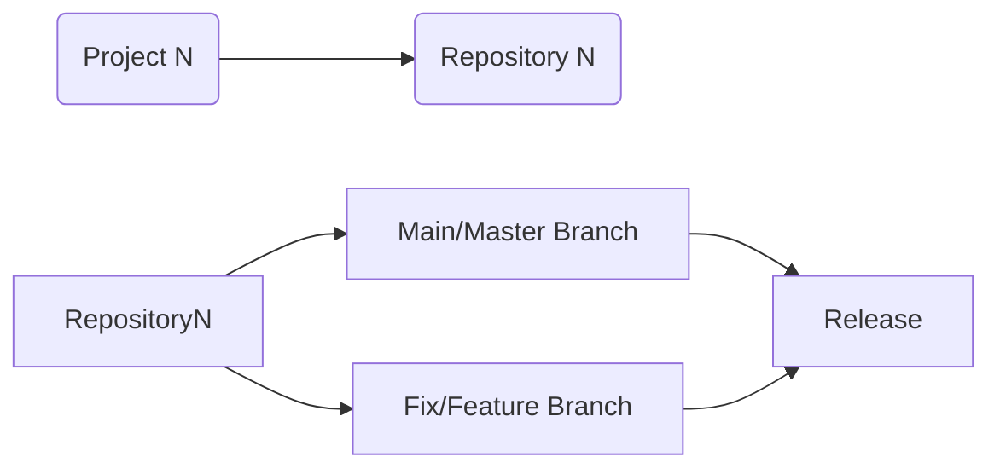

# CMPG-1-323-Overview---23561750
 "Your README file is like the "homepage of your project" - Ray Villalobos, LinkedIn Learning Learning Git and GitHub

## Which repositories will be created an used for each project?
According to each project's brief, each project will have its own repository. This is subject to change as the needs are assessed closer to the respective project due dates.
This overview repository will be used to keep track of everything from an "admin" point of view. 

## Diagram explaining project and repository context and how they are integrated
Where N = an integer associated with the project number

## Branching strategy to be used within each project
The simple "Git Flow" strategy mentioned by Ray Villalobos (see references) makes sense for this project and will be applied throughout the semester. 
In summary the strategy works as follows (my understanding and abstraction of Villalobos' methodology):
If there is a feature of a fix to be applied, create a branch.
Switch to that branch, make the changes. 
If the changes are stable and are as desired move on to the next step.
Merge the branch to the master/main branch.
If the merge is successful, delete the old branch.
Merge conflicts should not be a problem as the projects are individual assignments and therefore the strategy for dealing with merge conflicts will be ommited here. 
## Use of the .gitignore file in each project
The .gitignore file has been setup according to the specifications given by Villaolobos. In its current state it makes provision for files that might appear as a result of the MacOS operating system as well as files that are created by Visual Studio code. Both MacOS and Windows will be used.
The .gitignore file will be updated as needed. According to my understanding of both the course by Villalobos and the CMPG323 class, the gitignore file contains files that should NOT be uploaded to GitHub for security reasons. Therefore the file will be updated as necessary and comments will be made upon commits. 

## Explanation of storage of credentials and sensitive information

## References
- CMPG 323 Virtual classes.
- Learning Git and GitHub by Ray Villalobos on LinkedIn Learning. https://www.linkedin.com/learning/certificates/8628c83e71080540fa4cec08a4a88eb9e4a090517650933dd4338cc7ab6c53b7
- DevOps Foundations: DevSecOps by Tim Chase on LinkedIn Learning. https://www.linkedin.com/learning/certificates/e0c6fd5d03a2d8ae71cbf063358083f0fad01d1bdf5b34a33d4e7df2883431a4
- DevSecOps: Integrating Security into DevOps. https://www.isc2.org/Development/Immersive-Courses/DevSecOps
- GitHub Security Best Practices https://resources.github.com/downloads/109_SecurityassessmentPDF.1.pdf
- How to Add Diagrams to GitHub Markdown Files. https://www.freecodecamp.org/news/how-to-add-diagrams-to-github-readme/
- Mermaid repository. https://github.com/mermaid-js/mermaid

Disclaimer:
All rights are reserved. All code used in any project will be referenced according to the guidelines given by the lecturers of CMPG323.
A honest attempt will be made to refer to references where methodology comes into play. I admit that I have been influenced by the course materials that I have consumed and will follow DevSecOps and DevOps best practices. All scripts and work flow should be covered by the reference above to material that I have worked through prior to starting this project and the subsequent future projects. I claim no credit for any use of syntax, planning methods or best practices, I did not invent any of these. 
Kind regards
Armandt Roodt
